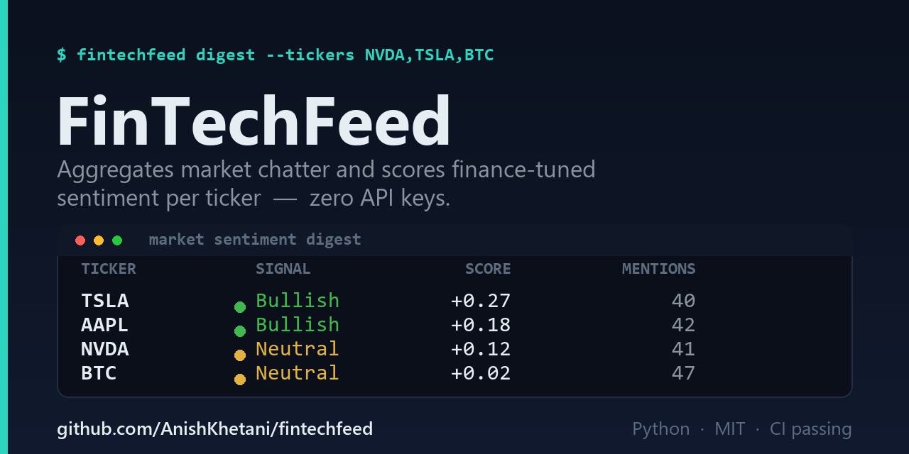

<p align="center">
  
</p>

# FinTechFeed

**A finance research agent that reads the market's chatter for you.**

FinTechFeed pulls headlines and posts about your watchlist from free, no-key
public sources, scores each with a **finance-tuned sentiment model**, and rolls
it all up into a ranked, cited **daily sentiment digest** — in your terminal, as
Markdown, or as JSON for a downstream pipeline.

No API keys. No paid data. `pip install` and run.

```bash
fintechfeed digest --tickers NVDA,TSLA,BTC
```

<p align="center"><em>Give an analyst's morning read — scan the tape, gauge the mood, cite the sources — to a 30-second command.</em></p>

---

## Why I built it

I trade a live multi-asset book and keep a structured research journal, and the
first 30 minutes of every session is the same ritual: scan the tape, read the
headlines, gauge whether the mood on a name is turning. FinTechFeed automates the
*gathering and scoring* of that ritual so the human part — the thesis — starts
from an evidence base instead of a blank page.

It's deliberately built around three ideas that matter in real research work:

1. **Signal over vibes.** Sentiment is *weighted by source trust* (curated
   financial press counts more than a retail thread) and every score is backed
   by clickable evidence, so you can audit any number.
2. **Resilience over completeness.** Each data source is an independent,
   swappable channel. If one rate-limits or breaks, the digest still runs on
   whatever else responded — it never returns partial garbage.
3. **Zero friction.** It runs on a fresh clone with no keys, so the output is
   reproducible by anyone.

## Demo

Real output from `fintechfeed digest` (Markdown format, abridged):

| Ticker | Signal | Score | Mentions | Sources |
| ------ | ------ | ----: | -------: | ------- |
| **TSLA** | 🟢 Bullish | +0.27 | 40 | hackernews: 21, yahoo_rss: 19 |
| **AAPL** | 🟢 Bullish | +0.18 | 42 | hackernews: 23, yahoo_rss: 19 |
| **NVDA** | 🟡 Neutral | +0.12 | 41 | hackernews: 20, yahoo_rss: 21 |
| **BTC**  | 🟡 Neutral | +0.02 | 47 | hackernews: 21, yahoo_rss: 26 |

**Evidence — TSLA (Bullish, +0.27)**
- `+0.84` [SpaceX Draws Bullish Analyst Views as Musk's Rocket Company Joins Nasdaq 100](https://finance.yahoo.com) — *yahoo_rss*
- `+0.79` [Tesla Model S achieves best safety rating of any car ever tested](https://news.ycombinator.com) — *hackernews*

> A full sample run is committed at [`docs/sample_digest.md`](docs/sample_digest.md)
> (and [`docs/sample_digest.json`](docs/sample_digest.json)).

## Quickstart

```bash
git clone https://github.com/anishkhetani/fintechfeed.git
cd fintechfeed
pip install -e .

# Check what works in your environment (probes every source live)
fintechfeed doctor

# Run a digest on the default watchlist
fintechfeed digest

# Focus on a few names, write Markdown to a file
fintechfeed digest --tickers NVDA,BTC,ETH --format markdown --out today.md

# Machine-readable output for a pipeline
fintechfeed digest --format json --out today.json
```

Requires Python 3.10+.

## How it works

```
                 ┌── yahoo_rss ──┐
   watchlist  →  ├── reddit ─────┤ →  ticker resolver  →  sentiment  →  aggregate  →  digest
                 └── hackernews ─┘     ($TAG + aliases)    (finance      (weighted     (terminal /
                                                            VADER)        mean+label)   md / json)
```

1. **Sources** each fetch market chatter and normalise it to a common `Item`
   shape. They're registered in a table, so config alone turns them on/off.
   A shared HTTP layer adds timeouts and polite retry/backoff (honouring
   `Retry-After`).
2. **Ticker resolution** maps each item to your watchlist via `$CASHTAG`
   detection, whole-word alias matching ("Apple" → AAPL, but not
   "applesauce"), and per-feed hints, with a stop-word guard against common
   words like `AI`/`CEO`.
3. **Sentiment** uses VADER as a baseline, extended with a **finance lexicon**
   so market language is scored correctly — `beat`, `upgrade`, and `guidance
   raised` read bullish; `miss`, `downgrade`, and `guidance cut` read bearish.
4. **Aggregation** computes a **source-weighted mean** compound score per
   ticker, buckets it into Bullish / Neutral / Bearish, and attaches the most
   opinionated evidence.

### Sources (all free, no API key)

| Source | What it gives you | Notes |
| ------ | ----------------- | ----- |
| `yahoo_rss` | Per-ticker financial-press headlines | Highest signal; items arrive pre-tagged |
| `reddit` | Retail sentiment from configurable subreddits | Public RSS feeds; Reddit rate-limits aggressively by IP |
| `hackernews` | Tech/crypto stories via the free Algolia API | Complements the finance press |

Adding a source is ~30 lines: subclass `Source`, implement `fetch()`, and add
one line to the registry.

## Configuration

Copy [`config.example.yaml`](config.example.yaml) to `config.yaml` (git-ignored)
and edit your watchlist, sources, source-trust weights, and sentiment
thresholds. Everything has sensible built-in defaults, so config is optional.

```yaml
watchlist:
  NVDA: ["Nvidia"]
  BTC: ["Bitcoin", "BTC-USD"]
sentiment:
  source_weights: { yahoo_rss: 1.0, reddit: 0.6, hackernews: 0.8 }
  min_mentions: 2
```

### Optional: LLM desk brief

If you set `llm.enabled: true`, install the extra (`pip install
fintechfeed[llm]`), and export `ANTHROPIC_API_KEY`, FinTechFeed will ask Claude to
write a short analyst-style narrative **grounded strictly in the evidence it
already gathered** (it is prompted not to invent prices or events). It's fully
opt-in and degrades to no-narrative if anything is missing.

## Design notes & honest limitations

- **Headline sentiment is a proxy, not a price target.** Lexicon models read
  the *tone* of a headline, which can diverge from a stock's actual outlook.
  FinTechFeed surfaces and cites evidence to reason *from*; it is a research aid,
  not a trading signal, and nothing here is financial advice.
- **Reddit is best-effort.** Reddit rate-limits public feeds aggressively; the
  resilient design treats a throttled source as a skipped channel rather than a
  failure.
- **Per-ticker feeds include adjacent market news**, so a ticker's bucket can
  contain sector-wide items — intentional, since sector tone moves names.

## Roadmap

- [ ] SEC EDGAR 8-K / filing sentiment channel
- [ ] Sentiment history + day-over-day deltas (a "mood is turning" signal)
- [ ] StockTwits and a FinTwit list channel
- [ ] Optional local FinBERT scorer as an alternative to the lexicon

## Development

```bash
pip install -e ".[dev]"
pytest          # unit tests (offline; sources are faked)
ruff check .    # lint
```

## Acknowledgements

The initial spark for this project came from studying
[**Agent-Reach**](https://github.com/Panniantong/Agent-Reach) by
[@Panniantong](https://github.com/Panniantong) — a CLI that gives AI agents
multi-platform internet access. Its "treat each platform as an independent,
swappable channel" framing shaped how FinTechFeed's source layer is organised.

To be clear about what is and isn't borrowed: FinTechFeed is an **independent,
from-scratch implementation** in a different problem domain (finance sentiment
research, not general agent tooling). **No code is copied from Agent-Reach** —
only the high-level channel-architecture idea was an influence. Credit for that
idea belongs to its author; any bugs here are my own.

Also built on the excellent open-source work of
[VADER](https://github.com/cjhutto/vaderSentiment) (sentiment baseline),
[feedparser](https://github.com/kurtmckee/feedparser), and
[rich](https://github.com/Textualize/rich).

## License

MIT © Anish Khetani — see [LICENSE](LICENSE).
